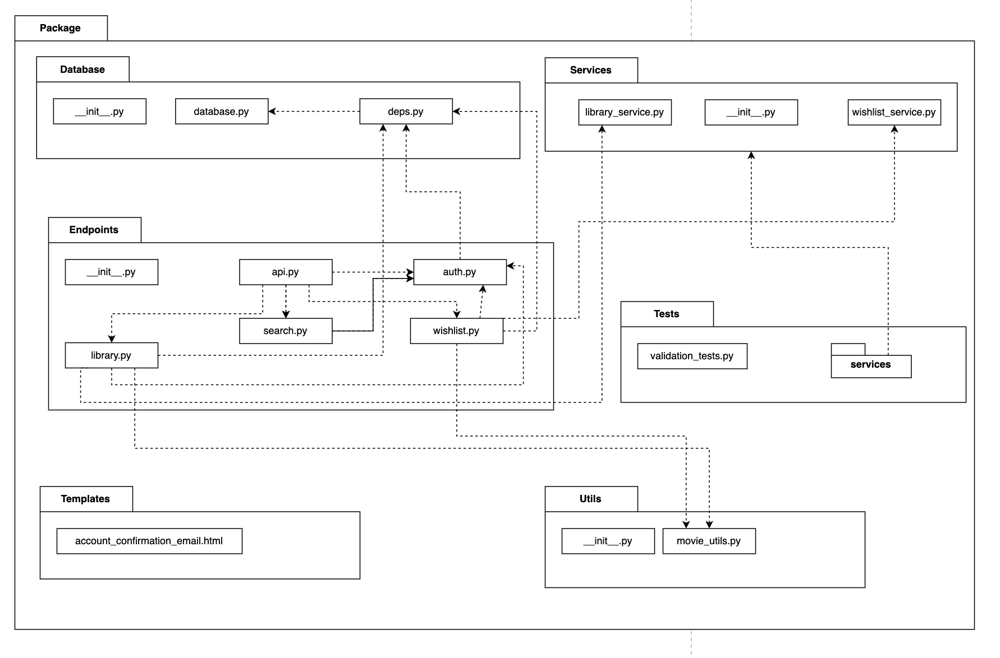
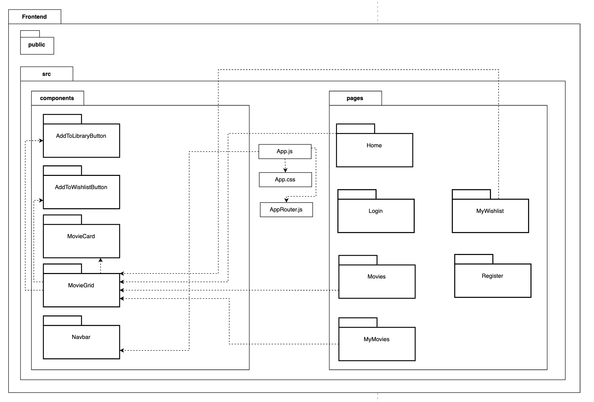

# Movie Tracker App: **"Cinemate"**


# Cinemate

**"Cinemate"** va fi o aplicație web proiectată atât pentru cinefilii înrăiți, cât și pentru utilizatorii obișnuiți care doresc să se delecteze din când în când cu un film pe placul lor. Ne propunem ca aplicația să fie o platformă completă și interactivă pentru tot ceea ce ține de lumea cinematografiei. **"Cinemate"** va oferi o gamă extinsă de funcționalități precum căutare și recomandare de filme, salvare de filme în arhivă. Principalele caracteristici ale acesteia sunt:

## Caracteristici

### Sistem de Gestiune al Utilizatorilor (Înregistrare, Autentificare)

- Un utilizator va fi capabil să își creeze un cont și să se autentifice.
- După autentificare, el va putea accesa funcționalități generale ale aplicației precum căutarea de filme ori adăugarea acestora la favorite.

### Sistem de Recomandări de Filme

- Pe baza filmelor din arhiva personală, utilizatorii autentificați vor primi recomandări de noi filme cu caracteristici similare (gen, tematică, actori, an apariție).

### Sistem de Căutare de Filme

- Un utilizator autentificat va putea căuta filme pe baza caracteristicilor acestora (gen, tematică, actori, an apariție) dar și pe baza unei scurte descrieri în limbaj natural a acestuia (actori, elemente de scenariu, replici).
- Căutarea asistată de inteligența artificială este o caracteristică inedită a platformei, integrând procesarea de limbaj natural și un model de învățare automată.

### Arhivă Personală

- Aplicația permite fiecărui utilizator să salveze o listă cu filme pe care fie le-a vizionat ori dorește să le vizioneze.
- Utilizatorii vor putea să își urmărească reciproc aceste arhive, stimulând astfel implicarea socială în vizionarea filmelor.

### Sistem de Notificări

- Aplicația va notifica utilizatorii cu privire la cele mai noi filme apărute și evenimente cinematografice (festivaluri de film, proiecții în aer liber, etc.).

### Pagina unui Film

- Conține imagini de prezentare, informații cu privire la acesta (gen, tematică, an apariție, actori, descriere etc.), și platformele de streaming pe care poate fi vizionat.

### Secțiune de Clasamente (TOP-uri)

- Va conține diferite clasamente, precum TOP N filme în funcție de țară sau gen, și TOP filme premiate.


## Flowchart Diagram


## Database Diagram


## Gantt Diagram


## Use case Diagram


## Component Diagram


## Class diagram
```mermaid
%%{init: {'theme':'neutral'}}%%
classDiagram
    class Movie {
        -String id
        +Enum genre
        +Int releaseYear
        +String imageUrl
        +String title
        +String[] Actors
    }
    class Review {
        -String id
        -String userId
        -String movieId
        +Int rating[1..10]
        +String reviewText
    }
  class Wishlist{
    -Int id
    -Movie movies[]
    +addMovie()
    +removeMovie()
}
class Library{
    -Int id
    -Movie movies[]
    +addMovie()
    +removeMovie()
    }
class User{
    -String id
    -String username
    -String password
    +Wishlist wishlist
    +Library library
    +login()
    +shareLibrary()
    +changePassword(newPassword)
    -sendConfirmationEmail()
    -getRecommendation()
    +addReview(movieId, rating, message)
}


Wishlist <-- Movie : contains
Library <-- Movie : contains
User *-- Wishlist : has
User *-- Library : has
Review o-- User : give
Review o-- Movie : to
```

## Diagrame de interactiune

```mermaid
sequenceDiagram
    participant Frontend
    participant Backend
    participant Database
    participant Email

    Frontend ->> Backend: Request for registering the new user
    activate Backend
    Backend ->> Email: Sending an email to the user
    activate Email
    Email ->> Backend: Accepting the invitation
    deactivate Email
    Backend ->> Database: Save user in DB
    Backend ->> Frontend: User account created
    deactivate Backend

    Frontend ->> Backend: Request for login the user
    activate Backend
    Backend ->> Database: Request the user in db
    activate Database
    Database ->> Backend: Accept/Deny user login
    deactivate Database
    Backend ->> Frontend: Login accepted or failed
    deactivate Backend
```

```mermaid
sequenceDiagram
    participant Frontend
    participant Backend
    participant Database
    participant PublicAPI

    Frontend ->> Backend: Request for Movie List
    activate Backend
    Backend ->> PublicAPI: Fetch Movie List
    activate PublicAPI
    PublicAPI -->> Backend: Movie List
    deactivate PublicAPI
    Backend -->> Frontend: Movie List Response
    deactivate Backend

    activate Frontend
    Frontend -->> Backend: Add movie to wishlist
    activate Backend
    Backend ->> Database: Store Wishlist
    activate Database
    Backend ->> Database: <<add>>
    Database -->> Backend: New wishlist returned
    deactivate Database
    Backend -->> Frontend: Wishlist Response
    deactivate Backend

```

## Diagrame de pachete

### Backend


### Frontend



## Design Patterns
Am folosit 3 design patterns la partea de backend:
### 1. Dependency Injection
```py
@router.get("/my-wishlist")
def get_all_wishlists(db: Session = Depends(deps.get_db), current_user: User = Depends(get_current_user)):
    service = WishlistService(db)
    wish_list_items = service.get_all_wishlists(current_user.id)
    return load_wish_list(movie_list=wish_list_items)
```
Dependency injection implementata in FastAPI, prin functia Depends, care primeste o dependenta necesara. 
- sesiunea bazei de date, prin returnata ca generator
```py
def get_db():
    try:
        db = SessionLocal()
        yield db
    finally:
        db.close()
```
- utilizatorul care este logat, necesar pentru a furniza datele despre contul

Avantaje dependency injection:
- separarea si modularizarea codului
- reutilizarea usoara a sesiunii bazei de date, la fiecare endpoint, fara a repeta codul
  
## 2. Decorator
Pentru a defini endpoint-urile, am folosit decoratorii din FastAPI, prin care specificam tipul de operatie: get/put/post/delete, response status, response model 

```py
@router.get("/search/{movie_title}", status_code=status.HTTP_200_OK, response_model=Any)
async def search_movie_title(
        movie_title: str,
        current_user: User = Depends(get_current_user),
        exact: bool = Query(False, description="Exact search for title"),
        year: int = Query(None, description="Filter by release year"),
        page: str = Query("1", description="Page number"),
        endYear: int = Query(None, description="Filter by max release year"),
        startYear: int = Query(None, description="Filter by min release year"),
        titleType: str = Query(None, description="Filter by movie type: movie or series"),
        limit: int = Query(10, description="Number of results per page")
):
```

## 3. MVC
Am structurat aplicatia conform design pattern-ului Model View Controller, in endpoints, service & model:

