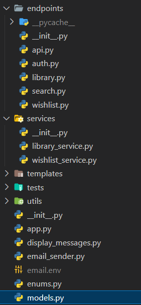

# Design Patterns

Am folosit 3 design patterns la partea de backend:

### 1. Dependency Injection

```py
@router.get("/my-wishlist")
def get_all_wishlists(db: Session = Depends(deps.get_db), current_user: User = Depends(get_current_user)):
    service = WishlistService(db)
    wish_list_items = service.get_all_wishlists(current_user.id)
    return load_wish_list(movie_list=wish_list_items)
```

Dependency injection implementata in FastAPI, prin functia Depends, care primeste o dependenta necesara.

- sesiunea bazei de date, prin returnata ca generator

```py
def get_db():
    try:
        db = SessionLocal()
        yield db
    finally:
        db.close()
```

- utilizatorul care este logat, necesar pentru a furniza datele despre contul

Avantaje dependency injection:

- separarea si modularizarea codului
- reutilizarea usoara a sesiunii bazei de date, la fiecare endpoint, fara a repeta codul

## 2. Decorator

Pentru a defini endpoint-urile, am folosit decoratorii din FastAPI, prin care specificam tipul de operatie: get/put/post/delete, response status, response model

```py
@router.get("/search/{movie_title}", status_code=status.HTTP_200_OK, response_model=Any)
async def search_movie_title(
        movie_title: str,
        current_user: User = Depends(get_current_user),
        exact: bool = Query(False, description="Exact search for title"),
        year: int = Query(None, description="Filter by release year"),
        page: str = Query("1", description="Page number"),
        endYear: int = Query(None, description="Filter by max release year"),
        startYear: int = Query(None, description="Filter by min release year"),
        titleType: str = Query(None, description="Filter by movie type: movie or series"),
        limit: int = Query(10, description="Number of results per page")
):
```

## 3. MVC

Am structurat aplicatia conform design pattern-ului Model View Controller, in endpoints, service & model:


