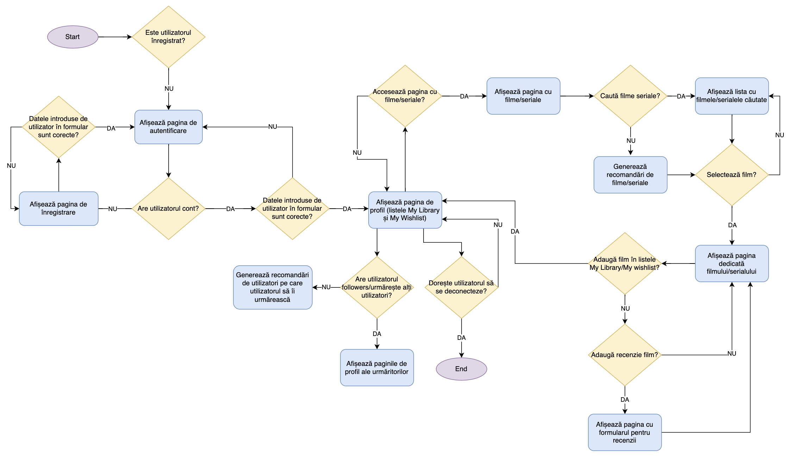
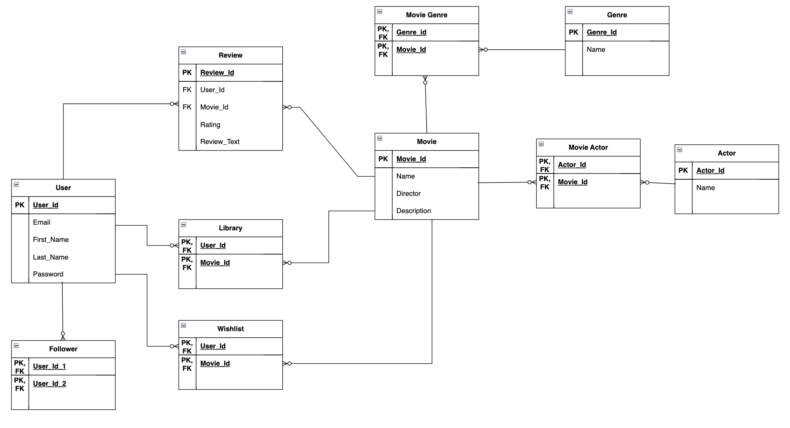
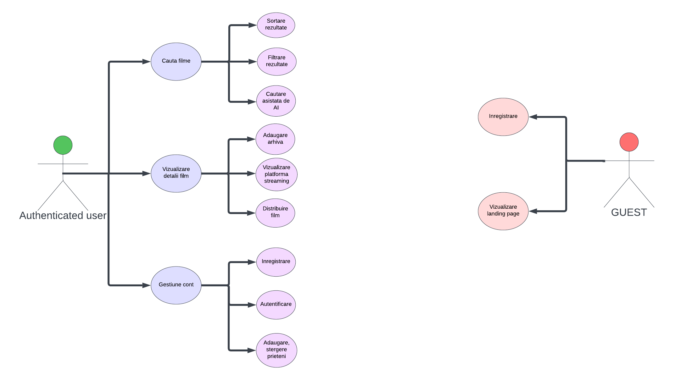
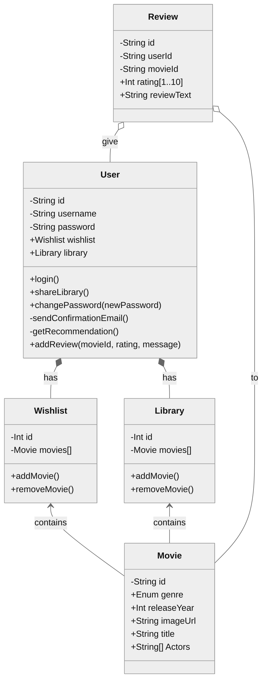
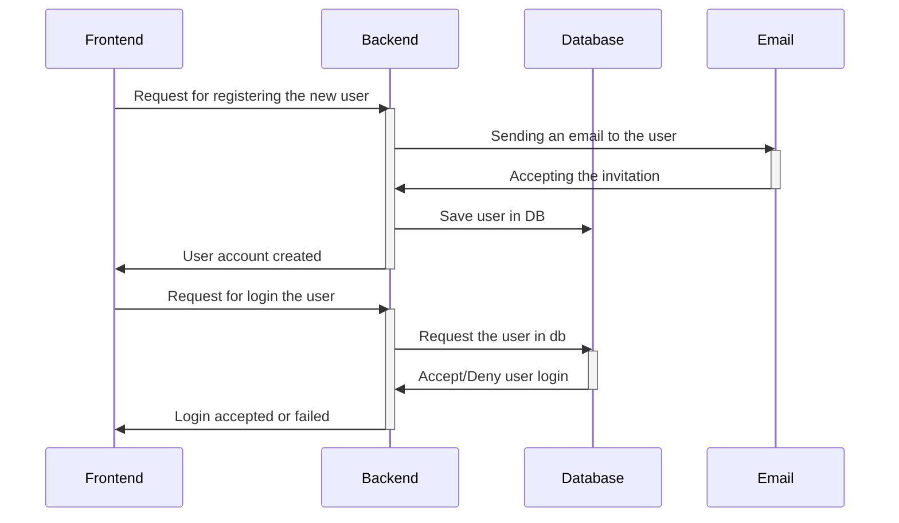
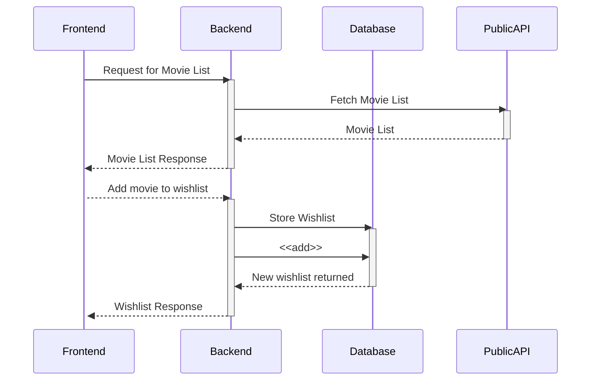
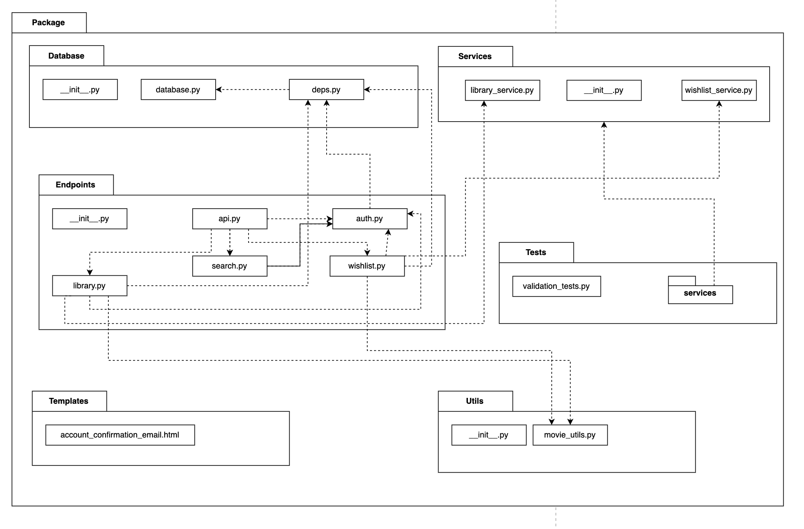
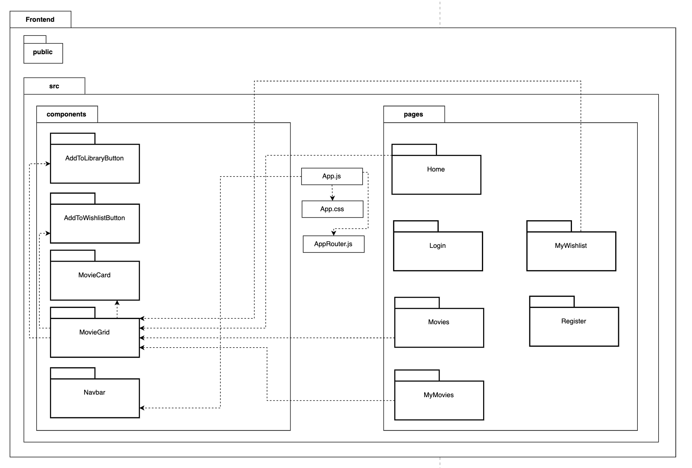
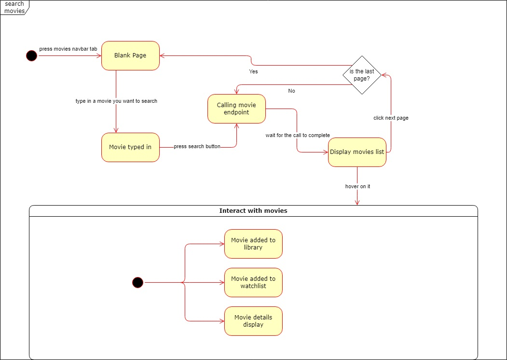

## 1. Flowchart Diagram (T)

Evidentiaza activitatea unui user, trecand prin toate starile aplicatiei.

## 2. Database Diagram (F)

Exemplifica campurile si cheile tabelelor din baza de date si relatiile dintre ele.

## 3. Use case Diagram (F)

Diagrama a actiunilor posibile, din perspectiva unui user autentificat dar si unuia neautentificat.

## 4. Class diagram (M)

Sunt prezentate clasele folosite pentru a construi aplicatia, continand datele membre si metodele fiecareia.

## Diagrame de interactiune

### 5. Inregistrarea unui utilizator (M)

Exemplifica interactiunea dintre Frontend, Backend, Database si email-ul utilizatorului, prin flow-ul unui request de inregistrare.

 

### 6. Obtinere a filmelor (R)

Interactiunea dintre Frontend, Backend, Database si API-ul care ne furnizeaza lista filmelor, atunci cand utilizatorul adauga un film in wishlist.

## Diagrame de pachete

### 7. Backend (A)

Prezinta pachetele utilizate in backend si relatiile dintre ele.

### 8. Frontend (A)

Prezinta pachetele utilizate in frontend si relatiile dintre ele.

## 9. Diagrame de stare (R)

Prezinta un state machine a paginii de cautare a unui film. Utilizatorul cauta un film dupa titlu, vede cate 10 filme pe fiecare pagina, poate sa treaca la pagina urmatoare si poate interactiona cu fiecare film in parte.

